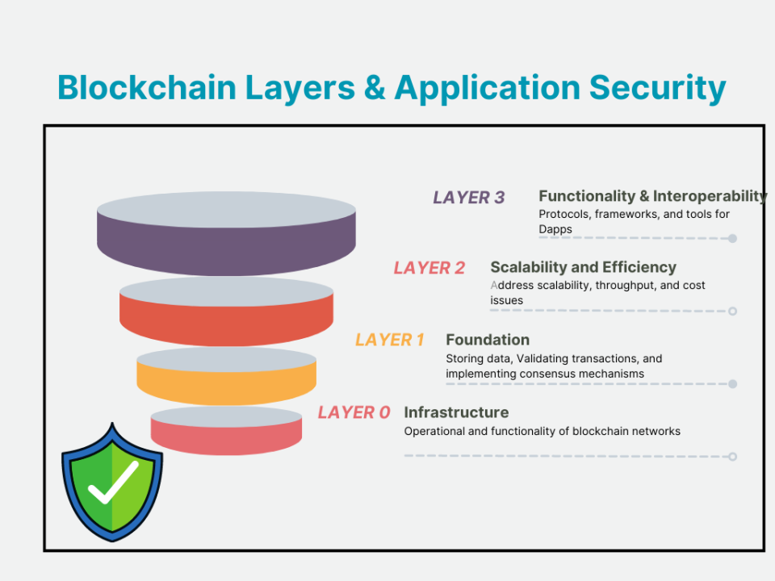
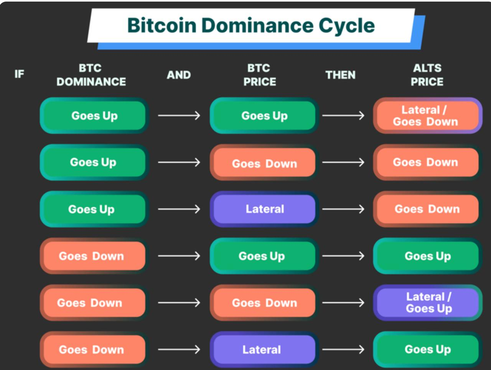

# Tutorial Crypto

## Layers Crypto

Diferentes blockchains aplicam-se a diferentes layers.

Exemplo de moedas por layers:

```
Layer 0 -> Polkadot, etc
Layer 1 -> BTC, Solana, Eth, PEAQ, etc 
Layer 2 -> Memecoins da solana, etc 
Layer 3 -> não sei 
```

Vamos supor a **Solana**, ela é uma moeda Layer 1, mas tu tens de ter todas as layers anteriores à que tu és, ou seja, ela precisa de ter a Layer 0 dentro de si, **mas não precisa da layer 2, nem layer 3.** 

Sempre que avanças uma layer precisas de ter sempre as anteriores, mas não precisas de ter as posteriores

As Memecoins por exemplo são Layer 2 , mas precisam de Layer 1 e da Layer 0.

O comum das Layers 1 é que elas criam a sua propria Layer 0 e 1, mas podes criar uma layer 1 apartir duma outra Layer 0 como a Polkadot.

A Polkadot é uma Layer 0 e a PEAQ é uma layer 1 que usa o Polkadot como seu Layer 0 envez de criar.



## Comprar moedas

Comprar moedas podes fazer de algumas maneiras, vou citar em baixo:

- CEX (Centralized Exchange)  -> é como se fosse um banco
- DEX (Descentraliz Exchange)
- Wallets diretamente


As wallets normalmente só compras moedas conhecidas ou moedas grandes, como Solana, BTC, etc...

Ou comprar **stable coins** que sao moedas estáveis que o preço é sempre **1 dolar**.

Por vezes vais precisar de outra moeda para comprar a que queres, por exemplo, queres comprar uma memecoin (layer 2) em solana (layer 1), para isso vais precisar de ter solana na tua wallet para conseguires **trocar** pela memecoin que queres.

#### Comprar por exemplo solana , polkadot ,etc

1. Abres uma CEX (Binance, Bingx, ByBit, etc) ou DEX (raydium, uniswap, jupiter, etc)

2. Se tiveres numa CEX (2.1) ou DEX (2.2)
    2.1

       Tens de criar conta, meter o teu CC, dar um comprovativo de morada e depois podes meter dinheiro no website ou comprar diretamente a moeda
    
    2.2 
    
       Tens de ter uma wallet, e ligar a tua wallet diretamente ao site, e depois tens de ter ou uma stable coin (USDT, USDC, etc..) ou ter outra moeda qualquer que consigas trocar

## Comprar Agora ou Não ? BTC, Solana

Como te disse, o mercado funciona por ciclos, e atualmente estamos (ao meu ver) no final do ciclo.

#### O que isto significa?
Isto quer dizer que investir agora tens uma alta probabilidade de comprares , o mercado cair, e teres que esperar 4 anos para teres um profit...

O mercado crypto mexe o dinheiro de um lado para o outro, por isso vamos supor que a bitcoin está muito valorizada, quando ela cair, o mercado vai vender e vai transicionar o dinheiro para outras moedas


## Porque o mercado cai ?

Tem várias razões para que o mercado cai.

Mas para isso temos que entender quem investe em crypto primeiro.

Temos: 
- Retail (Somos nós, meros mortais)
- Institutional (Empresas, instituicões, etc)
- Whales (Whales são pessoas com muito dinheiro, pode ser tanto retail como institutional)

Os Retails normalmente estão sempre na merda se não seguirem o chamado **smart money** , isto é o dinheiro das outras 2 categorias, dinheiro segue o dinheiro inteligente.

Se os outros 2 tomam alguma atitude no mercado, muito provavelmente o mercado mexe todo.


Bem vou por aqui algumas razões agora:
- O que falamos anteriormente
- Ciclos 
- Eventos mundiais
- Análises Técnicas (Saber isto permite-te saber onde pode haver mudanças de mercado , subida ou descida)
- Sentimento


## Ciclos

Os ciclos define quais moedas podem crescer.

O define isso é a BTC caso ela esteja a dominar o mercado e o preço dela.

Dominar o mercado significa que a maioria de todo o dinheiro que está no mercado de crypto (por exemplo 4 Trilhões de dolars), está focado no BTC, e o preço é caso o preço da BTC esteja forte.

Neste momento (Dezembro de 2024), estamos com BTC Dominance positiva e o Preço positivo, o que leva às ALTS coins a irem para o lado (o preço mantém) ou para baixo.

Link para veres a dominância: (alta é acima de 60% e vice versa)
https://www.tradingview.com/chart/CGAX9M7r/?symbol=CRYPTOCAP%3ABTC.D


Sentimento de mercado pode ser avalidado como fear ou greed (medo ou ganância)

https://alternative.me/crypto/fear-and-greed-index/

Quando está com greed, é quando todo o mercado está positivo e leva a uma subida do mercado, e quando está com grande fear é o contrário.





## Minha opinião de compra (Dezembro 2024)

Estou a investir em PEAQ que está em estado inicial, gosto de Polkadot, estou também algumas DeFIN (que isso para explicar demorar tempo), e tenho algumas memes, para o mês pretendo pegar Render e Chainlink